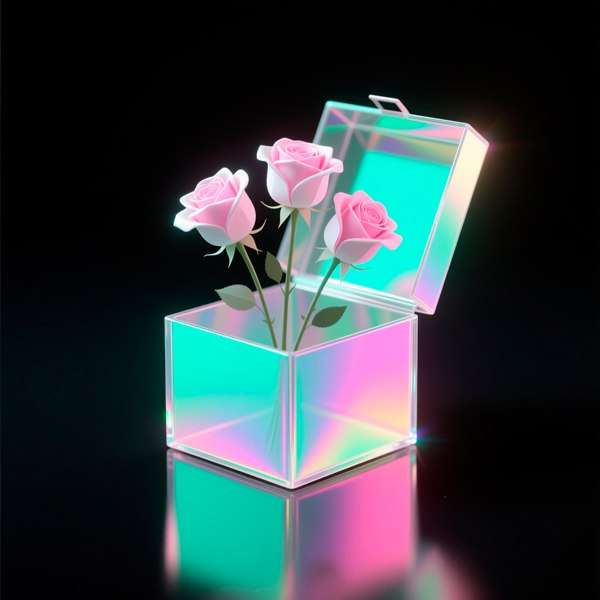
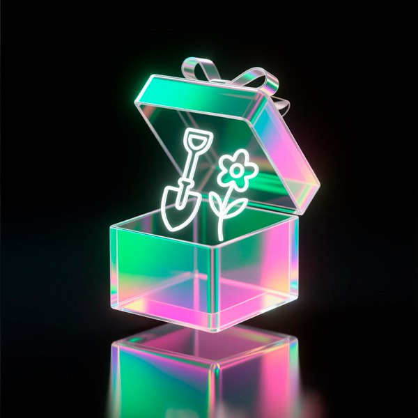
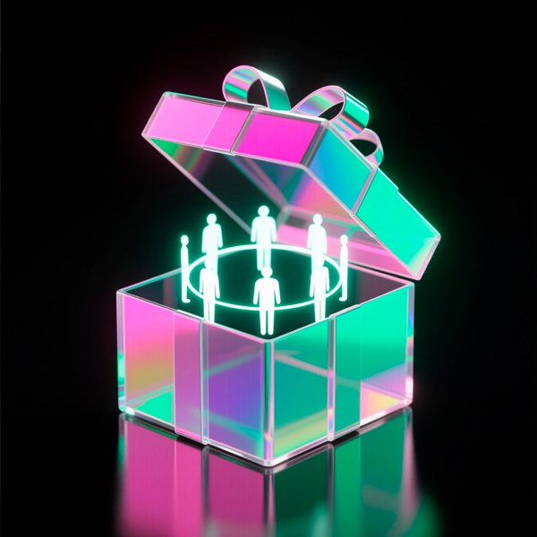
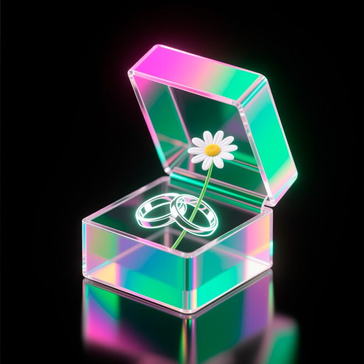

# Telegram Group Bot (Catalog)

---

<table style="width: 100%; border-collapse: collapse;">
  <tr>
    <td style="vertical-align: top; width: 0; padding: 0;">
      
    </td>
    <td style="vertical-align: top; padding-left: 15px;">
      <h3 style="margin-top: 0;">Festival</h3>
      
$0

    </td>
  </tr>
</table>
With purchases over $25, you receive all the gifts

---

<table style="width: 100%; border-collapse: collapse;">
  <tr>
    <td style="vertical-align: top; width: 0; padding: 0;">
      
    </td>
    <td style="vertical-align: top; padding-left: 15px;">
      <h3 style="margin-top: 0;">Новый год</h3>
      
$0

    </td>
  </tr>
</table>
Сюрприз-пробуждение: не про отсчёт, а про первое сообщение с мостика — приветствие от робота, который уже в пути, и вы — на борту

---

<table style="width: 100%; border-collapse: collapse;">
  <tr>
    <td style="vertical-align: top; width: 0; padding: 0;">
      
    </td>
    <td style="vertical-align: top; padding-left: 15px;">
      <h3 style="margin-top: 0;">День защитника Отечества</h3>
      
$0

    </td>
  </tr>
</table>
Сюрприз-бдительность: не про подвиг, а про ежедневную заботу к себе, близким, миру, даже когда никто не смотрит

---

<table style="width: 100%; border-collapse: collapse;">
  <tr>
    <td style="vertical-align: top; width: 0; padding: 0;">
      
    </td>
    <td style="vertical-align: top; padding-left: 15px;">
      <h3 style="margin-top: 0;">Женский день</h3>
      
$0

    </td>
  </tr>
</table>
Сюрприз-нежность: не про букет, а про то, как вдруг становится легко дышать весной и вы понимаете: да, я снова чувствую

---

<table style="width: 100%; border-collapse: collapse;">
  <tr>
    <td style="vertical-align: top; width: 0; padding: 0;">
      
    </td>
    <td style="vertical-align: top; padding-left: 15px;">
      <h3 style="margin-top: 0;">День весны и труда</h3>
      
$0

    </td>
  </tr>
</table>
Сюрприз-достоинство: не про отдых, а про уважение к той работе, которую вы делаете даже если её никто не видит

---

<table style="width: 100%; border-collapse: collapse;">
  <tr>
    <td style="vertical-align: top; width: 0; padding: 0;">
      
    </td>
    <td style="vertical-align: top; padding-left: 15px;">
      <h3 style="margin-top: 0;">День Победы</h3>
      
$0

    </td>
  </tr>
</table>
Сюрприз-тишина: не про парад, а про личный выбор помнить не как долг, а как пространство, в которое можно вдохнуть

---

<table style="width: 100%; border-collapse: collapse;">
  <tr>
    <td style="vertical-align: top; width: 0; padding: 0;">
      
    </td>
    <td style="vertical-align: top; padding-left: 15px;">
      <h3 style="margin-top: 0;">День защиты детей</h3>
      
$0

    </td>
  </tr>
</table>
Сюрприз-доверие: не про подарки, а про то, как мир вдруг становится ярче, когда ребёнок тянет вас за руку

---

<table style="width: 100%; border-collapse: collapse;">
  <tr>
    <td style="vertical-align: top; width: 0; padding: 0;">
      
    </td>
    <td style="vertical-align: top; padding-left: 15px;">
      <h3 style="margin-top: 0;">День России</h3>
      
$0

    </td>
  </tr>
</table>
Сюрприз-принадлежность: не про флаг, а про выбор где вам хорошо, и как вдруг оказывается: да, я дома

---

<table style="width: 100%; border-collapse: collapse;">
  <tr>
    <td style="vertical-align: top; width: 0; padding: 0;">
      
    </td>
    <td style="vertical-align: top; padding-left: 15px;">
      <h3 style="margin-top: 0;">День семьи, любви и верности</h3>
      
$0

    </td>
  </tr>
</table>
Сюрприз-простота: не про идеал, а про те мгновения, когда вы смеётесь вместе и вдруг понимаете: да, это и есть счастье

---

<table style="width: 100%; border-collapse: collapse;">
  <tr>
    <td style="vertical-align: top; width: 0; padding: 0;">
      
    </td>
    <td style="vertical-align: top; padding-left: 15px;">
      <h3 style="margin-top: 0;">День Знаний</h3>
      
$0

    </td>
  </tr>
</table>
Сюрприз-мудрость: не про оценки, а про вопрос, который не даёт уснуть и вдруг вы снова готовы удивляться

---

<table style="width: 100%; border-collapse: collapse;">
  <tr>
    <td style="vertical-align: top; width: 0; padding: 0;">
      
    </td>
    <td style="vertical-align: top; padding-left: 15px;">
      <h3 style="margin-top: 0;">День народного единства</h3>
      
$0

    </td>
  </tr>
</table>
Сюрприз-вместе: не про идеал, а про выбор — сегодня я выслушаю, сегодня я поддержу, сегодня я рядом

---

<table style="width: 100%; border-collapse: collapse;">
  <tr>
    <td style="vertical-align: top; width: 0; padding: 0;">
      
    </td>
    <td style="vertical-align: top; padding-left: 15px;">
      <h3 style="margin-top: 0;">Рождество</h3>
      
$0

    </td>
  </tr>
</table>
Сюрприз-встреча: не только про звезду над Вифлеемом, но и про то мгновение, когда вы вдруг чувствуете — да, свет пришёл, и он уже здесь

---

<table style="width: 100%; border-collapse: collapse;">
  <tr>
    <td style="vertical-align: top; width: 0; padding: 0;">
      
    </td>
    <td style="vertical-align: top; padding-left: 15px;">
      <h3 style="margin-top: 0;">Крещение</h3>
      
$0

    </td>
  </tr>
</table>
Сюрприз-обновление: не только про воду, а про ту тишину после, когда вы вдруг понимаете, что можно начать заново, и это дар

---

<table style="width: 100%; border-collapse: collapse;">
  <tr>
    <td style="vertical-align: top; width: 0; padding: 0;">
      
    </td>
    <td style="vertical-align: top; padding-left: 15px;">
      <h3 style="margin-top: 0;">Сретение</h3>
      
$0

    </td>
  </tr>
</table>
Сюрприз-встреча душ: не про храм, а про те мгновения, когда вы смотрите в глаза другому и узнаёте в нём что-то родное, светлое

---

<table style="width: 100%; border-collapse: collapse;">
  <tr>
    <td style="vertical-align: top; width: 0; padding: 0;">
      
    </td>
    <td style="vertical-align: top; padding-left: 15px;">
      <h3 style="margin-top: 0;">Благовещение</h3>
      
$0

    </td>
  </tr>
</table>
Сюрприз-согласие: не про «да» Марии, а про ваше собственное «да» тому, что вы ещё не видите, но уже чувствуете

---

<table style="width: 100%; border-collapse: collapse;">
  <tr>
    <td style="vertical-align: top; width: 0; padding: 0;">
      
    </td>
    <td style="vertical-align: top; padding-left: 15px;">
      <h3 style="margin-top: 0;">Вербное воскресение</h3>
      
$0

    </td>
  </tr>
</table>
Сюрприз-радость в пути: про ту лёгкость, которая бывает, когда вы идёте навстречу важному даже не зная, что ждёт в конце

---

<table style="width: 100%; border-collapse: collapse;">
  <tr>
    <td style="vertical-align: top; width: 0; padding: 0;">
      
    </td>
    <td style="vertical-align: top; padding-left: 15px;">
      <h3 style="margin-top: 0;">Пасха Христова</h3>
      
$0

    </td>
  </tr>
</table>
Сюрприз-возможность: про те дни, когда вы вдруг понимаете да, можно снова начать, даже после самого тяжёлого

---

<table style="width: 100%; border-collapse: collapse;">
  <tr>
    <td style="vertical-align: top; width: 0; padding: 0;">
      
    </td>
    <td style="vertical-align: top; padding-left: 15px;">
      <h3 style="margin-top: 0;">Вознесение</h3>
      
$0

    </td>
  </tr>
</table>
Сюрприз-присутствие: не про небо, а про ту уверенность, которая приходит, когда вы вдруг чувствуете я не один, даже в тишине

---

<table style="width: 100%; border-collapse: collapse;">
  <tr>
    <td style="vertical-align: top; width: 0; padding: 0;">
      
    </td>
    <td style="vertical-align: top; padding-left: 15px;">
      <h3 style="margin-top: 0;">Троица</h3>
      
$0

    </td>
  </tr>
</table>
Сюрприз-целостность: не про догму, а про те мгновения, когда вы чувствуете — да, я целый: душа говорит, сердце слышит, тело знает

---

<table style="width: 100%; border-collapse: collapse;">
  <tr>
    <td style="vertical-align: top; width: 0; padding: 0;">
      
    </td>
    <td style="vertical-align: top; padding-left: 15px;">
      <h3 style="margin-top: 0;">Петр и Феврония</h3>
      
$0

    </td>
  </tr>
</table>
Сюрприз-верность: не про святых, а про те мгновения, когда вы выбираете остаться, выслушать, поверить, даже если легко уйти

---

<table style="width: 100%; border-collapse: collapse;">
  <tr>
    <td style="vertical-align: top; width: 0; padding: 0;">
      
    </td>
    <td style="vertical-align: top; padding-left: 15px;">
      <h3 style="margin-top: 0;">Преображение</h3>
      
$0

    </td>
  </tr>
</table>
Сюрприз-свет внутри: не про гору Фавор, а про те дни, когда вы вдруг смотрите в зеркало и видите не усталость, а то, что сияет сквозь неё

---

<table style="width: 100%; border-collapse: collapse;">
  <tr>
    <td style="vertical-align: top; width: 0; padding: 0;">
      
    </td>
    <td style="vertical-align: top; padding-left: 15px;">
      <h3 style="margin-top: 0;">Воздвижение</h3>
      
$0

    </td>
  </tr>
</table>
Сюрприз-знак надежды: не про крест как символ страдания, а про него как точку опоры — когда мир качается, а вы всё ещё стоите

---

<table style="width: 100%; border-collapse: collapse;">
  <tr>
    <td style="vertical-align: top; width: 0; padding: 0;">
      
    </td>
    <td style="vertical-align: top; padding-left: 15px;">
      <h3 style="margin-top: 0;">Покров</h3>
      
$0

    </td>
  </tr>
</table>
Сюрприз-защита: не про небесное покрывало, а про ту тишину, когда вы вдруг чувствуете — меня хранят, даже когда я не прошу